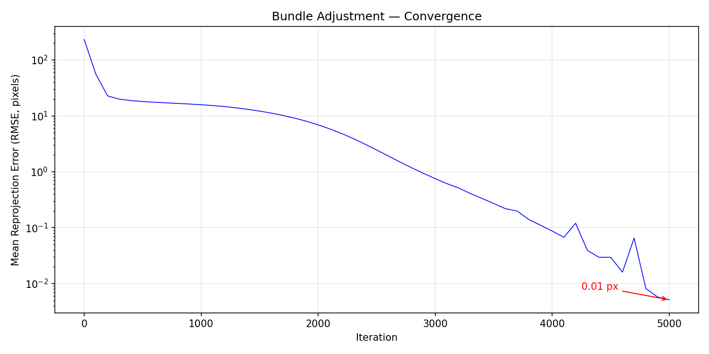
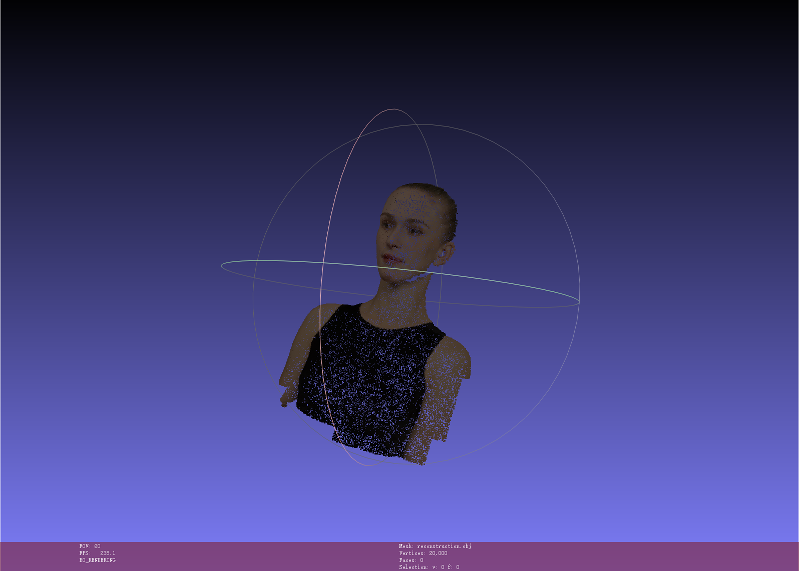
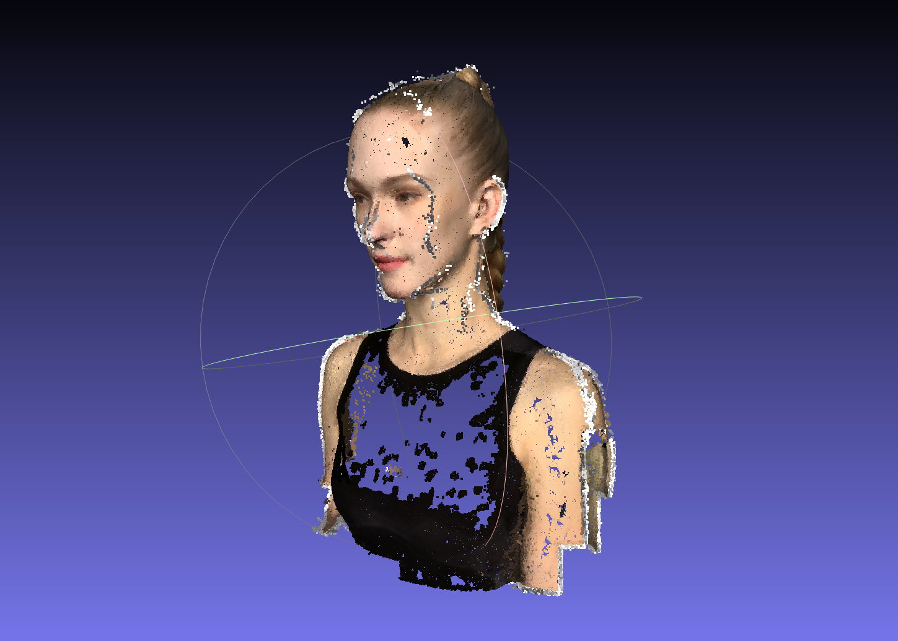

# 作业三：光束法平差与三维重建

杨洁 SC25005001

数字图像处理课程作业三，包含两部分内容：一是基于 PyTorch 从零实现光束法平差（Bundle Adjustment, BA），通过梯度下降联合优化相机参数和三维点坐标；二是使用 COLMAP 工业级三维重建管线对多视角图像进行稀疏和稠密重建。

## 任务一：基于 PyTorch 的光束法平差

### 问题描述

给定 50 个不同视角下 20000 个三维点的 2D 像素观测坐标，以及每个点在各视角下的可见性信息，需要同时求解：
- 所有相机共享的内参：焦距 f（主点固定在图像中心）
- 每个相机的外参：旋转矩阵 R 和平移向量 T（共 50 组）
- 所有三维点的世界坐标 (X, Y, Z)（共 20000 个点）

这是一个经典的光束法平差问题，本质上是一个大规模非线性最小二乘优化问题。传统方法使用 Levenberg-Marquardt 算法求解，本实现利用 PyTorch 的自动微分能力，通过梯度下降法求解。

### 投影模型

采用针孔相机模型，坐标系约定为：物体位于原点，朝向 +Z 轴方向，相机分布在 +Z 一侧。

对于世界坐标系中的点 P = (X, Y, Z)，经过相机外参变换到相机坐标系：
```
P_cam = R @ P + T = [Xc, Yc, Zc]
```
然后通过透视投影得到像素坐标：
```
u = -f * Xc / Zc + cx
v =  f * Yc / Zc + cy
```
其中 cx = cy = 512 为主点坐标（图像中心）。X 坐标取负号是因为相机朝向 -Z 方向（Zc < 0），若不取负号会导致图像左右翻转。

### 参数化方式

- **焦距 f**：单个标量，初始值由视场角 FOV ≈ 60° 估算：f = H / (2 · tan(FOV/2)) ≈ 887
- **旋转 R**：使用欧拉角（XYZ 顺序）参数化，每个相机 3 个参数，通过 `pytorch3d.transforms.euler_angles_to_matrix` 转换为 3×3 旋转矩阵。初始值为全零（即单位旋转）
- **平移 T**：每个相机 3 个参数，初始值为 [0, 0, -2.5]，即相机初始位于 Z = 2.5 处看向原点
- **三维点坐标**：每个点 3 个参数，初始化为原点附近标准差为 0.1 的高斯随机扰动

### 损失函数与优化

损失函数为可见点的平均 L2 重投影误差：
```
loss = mean(||(u_proj, v_proj) - (u_gt, v_gt)||²)  （仅对可见点计算）
```
可见性由 `points2d.npz` 中的 visibility 数组遮罩，不可见的点不参与损失计算。

优化配置：
- 优化器：Adam
- 学习率调度：ReduceLROnPlateau，当损失停滞时自动降低学习率
- 所有参数均为可学习参数，梯度通过整个投影管线自动反向传播

### 运行方式

```bash
python bundle_adjustment.py
```

脚本执行流程：
1. 加载 `data/points2d.npz` 中的 2D 观测和可见性信息
2. 加载 `data/points3d_colors.npy` 中的点颜色（用于可视化）
3. 初始化焦距、相机外参和三维点坐标
4. 进行梯度下降优化，每 100 次迭代打印当前损失
5. 优化结束后绘制损失曲线保存为 `loss_curve.png`
6. 将优化后的三维点连同颜色导出为 OBJ 格式点云 `reconstruction.obj`

### 结果展示

**收敛曲线：**



重投影误差在迭代初期快速下降，经过约 5000 次迭代后收敛到较低值，说明相机参数和三维几何均已成功恢复。曲线中的小波动是由于 Adam 优化器的自适应学习率导致的正常现象。

**重建点云：**



优化后的三维点构成完整的头部形状，五官轮廓清晰，与真实几何高度吻合。点云以带顶点颜色的 OBJ 格式保存，可使用 MeshLab、CloudCompare 等三维查看软件打开浏览。

## 任务二：基于 COLMAP 的三维重建

### 重建流程

使用 COLMAP 对 50 张渲染图像执行完整的三维重建管线，共包含 6 个步骤：

| 步骤 | COLMAP 命令 | 功能说明 |
|------|------------|---------|
| 1. 特征提取 | `feature_extractor` | 使用 SIFT 算法从每张图像中提取尺度不变特征点和描述子 |
| 2. 特征匹配 | `exhaustive_matcher` | 穷举所有图像对，基于描述子距离进行特征匹配 |
| 3. 稀疏重建 | `mapper` | 增量式运动恢复结构，逐步注册图像、三角化三维点，并执行内部光束法平差优化 |
| 4. 图像去畸变 | `image_undistorter` | 对图像进行去畸变处理，为稠密立体匹配做准备 |
| 5. Patch Match 立体匹配 | `patch_match_stereo` | 利用 GPU 加速的 Patch Match 算法，逐视角计算稠密深度图和法向图 |
| 6. 点云融合 | `stereo_fusion` | 将所有视角的深度图融合为统一的稠密三维点云，去除冗余和噪声点 |

### 运行方式

```bash
bash run_colmap.sh
```

脚本按顺序执行上述 6 个步骤，最终输出稀疏重建结果和稠密点云。

### 结果展示

**稠密重建结果：**



COLMAP 成功配准了全部 50 个视角，最终融合得到的稠密点云包含超过 10 万个三维点，完整还原了头部模型的表面几何，五官细节清晰可见。输出文件 `fused.ply` 可在三维查看软件中浏览。

## 结果汇总

| 任务 | 方法 | 输出文件 |
|------|------|---------|
| 任务一 | PyTorch 从零实现光束法平差 | `reconstruction.obj`（2 万带色点云）、`loss_curve.png`（损失曲线） |
| 任务二 | COLMAP SfM + MVS | `fused.ply`（稠密点云）、`fused.png`（结果截图） |

## 总结

通过本次作业，深入理解了光束法平差的数学原理和实现方法。利用 PyTorch 自动微分实现 BA 相比传统 LM 算法代码更简洁，但在收敛速度和精度上仍有差距。COLMAP 作为工业级重建工具，其完整的管线和 GPU 加速使得稠密重建效果远优于手写实现。

## 致谢

- [COLMAP](https://colmap.github.io/) — 通用三维重建管线
- [PyTorch3D](https://pytorch3d.readthedocs.io/) — 三维深度学习工具库
