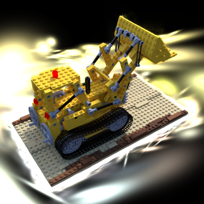

# 作业四：简化版三维高斯泼溅

杨洁 SC25005001

数字图像处理课程作业四，基于纯 PyTorch 实现了一个简化版的三维高斯泼溅（3D Gaussian Splatting, 3DGS）。完整管线包括：使用 COLMAP 进行运动恢复结构（SfM）获取初始相机参数和稀疏点云、三维高斯参数化与协方差计算、可微投影与二维高斯求值、α 混合体渲染，以及端到端梯度下降优化。

## 环境依赖

```setup
pip install torch torchvision numpy opencv-python tqdm
```

任务一（SfM 初始化）需要额外安装 COLMAP。

## 任务一：基于 COLMAP 的运动恢复结构

首先使用 COLMAP 从多视角图像中恢复相机内参、外参以及稀疏三维点云。这些稀疏点将作为三维高斯的初始位置，避免从随机初始化开始优化导致收敛困难。

### 运行方式

执行 COLMAP 稀疏重建：
```bash
python mvs_with_colmap.py --data_dir data/lego
```

该脚本依次执行 COLMAP 的特征提取、穷举匹配和增量式 SfM（mapper），输出相机参数和稀疏点云到 `data/lego/sparse/` 目录。

验证相机位姿是否正确（将三维点重投影回图像）：
```bash
python debug_mvs_by_projecting_pts.py --data_dir data/lego
```
脚本会生成重投影叠加图，若三维点准确贴合在物体表面则说明位姿恢复正确。

## 任务二：简化版三维高斯泼溅

### 三维高斯参数化

每个三维高斯由一组可学习参数表示：

| 参数 | 形状 | 参数化空间 | 初始化方式 |
|------|------|-----------|-----------|
| 位置 μ | (N, 3) | 世界坐标 | COLMAP 稀疏点坐标 |
| 旋转 q | (N, 4) | 单位四元数 | 初始化为 [1,0,0,0]（单位旋转） |
| 缩放 s | (N, 3) | 对数空间 | 初始化为局部 KNN 平均距离 |
| 不透明度 o | (N, 1) | logit 空间 | 初始值对应约 0.999（近不透明） |
| 颜色 c | (N, 3) | logit RGB | 初始化为稀疏点对应的图像颜色 |

使用对数空间和 logit 空间参数化缩放和不透明度，是为了保证优化过程中缩放始终为正、不透明度始终在 (0,1) 范围内。

**协方差矩阵**按论文公式计算：
```
Σ = R · S · S^T · R^T
```
其中 R 是由单位四元数转换得到的 3×3 旋转矩阵，S 是由缩放参数构成的对角矩阵。旋转矩阵通过四元数到旋转矩阵的标准公式计算。

### 三维到二维投影

渲染时需要将三维高斯投影到图像平面，得到二维高斯。步骤如下：

1. **世界到相机变换**：将三维均值和协方差变换到相机坐标系
   ```
   μ_cam = R_cam @ μ + T_cam
   Σ_cam = W · Σ · W^T
   ```
   其中 W = R_cam 是相机旋转矩阵（世界到相机）。

2. **透视投影**：将相机坐标系下的三维点投影到像素坐标
   ```
   μ' = [f·Xc/Zc + cx, f·Yc/Zc + cy]
   ```

3. **雅可比矩阵**：计算透视投影在 μ_cam 处的雅可比矩阵 J（2×3），用于将三维协方差投影到二维
   ```
   J = [[f/Zc, 0, -f·Xc/Zc²],
        [0, f/Zc, -f·Yc/Zc²]]
   ```

4. **二维协方差**：
   ```
   Σ' = J · Σ_cam · J^T
   ```
   计算完成后对 Σ' 加一个小的对角矩阵保证正定性，避免数值问题。

### 二维高斯求值与 α 混合渲染

对于每个像素，计算所有二维高斯在该像素处的函数值：
```
G(x) = 1/(2π√|Σ'|) · exp(-½ (x-μ')^T Σ'^{-1} (x-μ'))
```

渲染采用从前到后的 α 混合（Alpha Compositing）。首先将所有高斯按相机坐标系下的深度 Zc 从小到大排序（从前到后），然后依次累积：
```
α_i = σ(o_i) · G(x_i)
T_i = Π_{j<i} (1 - α_j)
C_pixel = Σ_i T_i · α_i · σ(c_i)
```
其中 σ 为 sigmoid 函数，将不透明度和颜色映射到有效范围。T_i 为透过率，表示该高斯之前所有高斯累积后的剩余透明度。

本实现为朴素版本，对每个像素遍历所有高斯求值，时间复杂度为 O(N·H·W)，在高斯数量较多时显存占用较大。官方实现使用分块光栅化（Tile-based Rasterizer），仅处理每个图像块内有贡献的高斯，效率大幅提升。

### 训练配置

- **损失函数**：渲染图像与真值图像的 L1 像素损失
- **优化器**：Adam，不同参数组使用不同学习率（位置学习率最小，避免几何发散；颜色和不透明度学习率较大，可快速调整外观）：
  - 位置：1.6e-5
  - 颜色：0.025
  - 不透明度：0.05
  - 缩放：0.005
  - 旋转：0.001
- **梯度裁剪**：最大梯度范数 1.0，防止梯度爆炸
- **训练轮数**：200 epoch
- **批次大小**：1（每次随机选取一个视角渲染）
- **检查点**：每 20 个 epoch 保存一次模型权重

### 运行方式

开始训练：
```bash
python train.py --colmap_dir data/lego --checkpoint_dir data/lego/checkpoints
```

训练过程中每个 epoch 都会保存调试对比图（真值 vs 渲染结果）到 `checkpoints/debug_images/` 目录，可以直观观察渲染质量的提升过程。

训练完成后，渲染环绕视角视频：
```bash
python render_3dgs_mv.py --colmap_dir data/lego --checkpoint data/lego/checkpoints/checkpoint_000060.pt --num_frames 240 --fps 30
```
脚本生成一段沿水平圆轨迹环绕场景的视频，保存为 `render_mv.mp4`，用于验证新视角合成效果。

## 任务三：与官方 3DGS 实现对比

官方 3DGS 在 lego 场景训练 5000 次迭代后的渲染结果：



| 对比维度 | 本简化实现 | 官方 3DGS |
|---------|-----------|-----------|
| 渲染质量 | 可辨认物体大致形状，细节较模糊 | 照片级真实感，边缘锐利，细节丰富 |
| 训练速度 | 较慢，朴素逐像素求值 | 极快，CUDA 分块光栅化器，单步秒级 |
| 显存占用 | 较高，需存储完整 N×H×W 张量 | 高效，按分块处理，支持百万级高斯 |
| 高斯数量 | 固定，等于 SfM 初始稀疏点数 | 自适应，训练中动态分裂/克隆/剪枝 |
| 颜色模型 | 视角无关的固定 RGB | 视角相关的球谐函数（Spherical Harmonics） |
| 正则化 | 无 | 各向异性正则、深度正则等 |

质量差距的主要原因：
1. **自适应致密化**：官方实现在训练过程中会在欠重建区域将高斯分裂为两个，在透明区域剪枝高斯，高斯数量从初始的几千增长到百万级，这是细节质量差距的最主要来源。
2. **分块光栅化器**：官方实现了高度优化的 CUDA 分块光栅化器，避免了朴素实现中大量无贡献高斯的计算，是速度差距的核心。
3. **球谐颜色**：官方使用球谐函数表示视角相关颜色，能正确还原高光和反射效果，本实现为视角无关颜色，无法表现视角相关效果。

## 文件结构

| 文件 | 功能说明 |
|------|---------|
| `gaussian_model.py` | 三维高斯模型定义，包括四元数旋转、协方差矩阵计算 |
| `gaussian_renderer.py` | 渲染器，包括三维到二维投影、二维高斯求值、α 混合 |
| `train.py` | 训练主循环，包括数据加载、优化器、损失计算、检查点保存 |
| `data_utils.py` | COLMAP 数据加载工具类，读取相机参数、图像、稀疏点 |
| `mvs_with_colmap.py` | COLMAP SfM 封装脚本 |
| `debug_mvs_by_projecting_pts.py` | 重投影验证脚本 |
| `render_3dgs_mv.py` | 多视角环绕视频渲染 |

## 总结

3DGS 的核心思想——用三维高斯表示场景、通过可微溅射渲染端到端优化——并不复杂，用 PyTorch 实现一个能跑的简化版本难度不大。但要达到官方实现的质量和速度，CUDA 编程和工程优化（分块光栅化、自适应致密化、球谐光照等）是关键。本次作业深入理解了 3DGS 的数学原理和可微渲染管线。

## 致谢

- [3D Gaussian Splatting for Real-Time Radiance Field Rendering](https://repo-sam.inria.fr/fungraph/3d-gaussian-splatting/3d_gaussian_splatting_low.pdf) — Kerbl et al., SIGGRAPH 2023
- [官方 3DGS 实现](https://github.com/graphdeco-inria/gaussian-splatting)
- [COLMAP](https://colmap.github.io/) — 运动恢复结构管线
